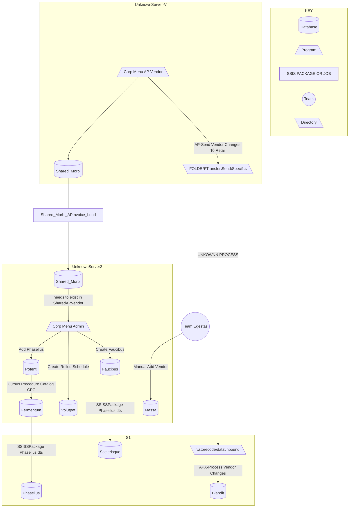

# Onboarding Process

## Onboarding Process Layman's Terms

### Vendors to Stores

1. Create vendor in Corporate AP Vendor || Shared_Morbi (UnknownServer)
2. (UnknownServer) sends AP Vendor changes to add or update Vendors to selected stores in AP Vendor List (Retail Setup Tab)
3. SSIS package moves data to Shared_Morbi (UnknownServer2)
4. EDI uses  ADMIN to add  Vendor,  Vendor Defaults, and Rollout Schedule
5. Stored procedure creates or updates Fermentum from Phasellus
6. SSIS package moves data from Phasellus, Faucibuss (UnknownServer2) to store level Phasellus, Scelerisque (S1)

### Vendor items to stores /  Catalog

1. Once Phasellus exist at stores and is fully integrated at UnknownServer2, team Egestas will add vendor to the Distribution List Group so catalog can distribute items to the store.
   1. Currently, the code only cares about all stores and may need to be re-worked.

---

##  Onboarding Process Technical Terms

### `Job Details`

<details>
  <summary>(UnknownServer-SQLJOB) Shared_Morbi_APInvoice_Load</summary>
  
  ```
  1. Runs Shared_Morbi_Load_UnknownServer2.dtsx
      - Loads data from Shared_Morbi (`UnknownServer`) to Shared_Morbi (`UnknownServer2`)
  2. Frequency
      - M,T,W,Thu,Sun @ 23:30
  ```

</details>

<details>
<summary>Corporate Price Changes</summary>

  ```
  1. Runs Cursus Procedure
    - Creates or updates Fermentum from Phasellus (`UnknownServer2`)
  2. Frequency
    - Daily 2:00 - 23:00 on the hour, also runs at 2:30
  ```

</details>

<details>
  <summary>(UnknownServer2-SQLJOB)Retail Apps - ScanBasedTradingCatalog</summary>
  
  ```
  1. Runs Update Catalog
      - _CatalogUpdate.exe
  2. Runs Phasellus.dtsx
      - Syncs Data From UnknownServer2 to S1
  3. Frequency
      - M,W,F,Sat,Sun 5:30
      - T,Thu,Sun 6:30
      - Daily 20:00
  ```

</details>

<details>
  <summary>(UnknownServer-SQLJOB) AP-Send Vendor Changes To Retail</summary>
  
  ```
  1. Sync VendorRetailAccess Table
      - STOREPROCEDURE
  2. Execute Application
      - \\UNKNOWNSERVER3\PATH.exe
  3. Frequency
      - Daily 20:45
 ```

</details>

<details>
  <summary>(S1-SQLJOB) APX-Process Vendor Changes</summary>
  
  ```
  1. Execute Application
      - PATH.exe
  2. Frequency
      - Daily 22:00
  ```

</details>

&NewLine;

### Create Vendor In Corporate AP Vendor

1. EDI enters the data in Corp menu AP Vendor New Vendor Wizard
2. `AP_User` table that gives access to the plus button in Corp Menu AP Vendor.
3. `AP_Access` returns these three columns uco_readonly, uco_bankaccess,uco_creditBalanceEdit
4. If nothing is returned default to readonly otherwise set accoudingly. The uco_readonly needs to be set to 0 for access to the plus button
5. `AP_VendVendorWizard`

   1. `PDF`
   2. ave_vendorCode is generated by older vendor codes in apVendor, incriminates by 100.
      <details>
      <summary>DETAILS Vendor Code Creation</summary>

      ```sql
      SELECT  @strVendorCode = CONVERT(VARCHAR, CONVERT(INT, MAX(ave_vendorCode)) + 100)
      FROM    dbo.Shared_Morbi
      WHERE   ave_vendorCode <> 'UNKNOWN'
          AND ave_vendorCode <> '99999999'
          AND ave_vendorCode LIKE '%00'
      ```

      </details>

---

### Shared_Morbi updates and changes Sync to Blandit at the store

1. (UnknownServer-SQLJOB) AP-Send Vendor Changes To Retail runs. Data from AP Vendor Application creates XML file placed in FOLDER\Transfer\Send\Specific\
2. Unkown process takes these xml files and places them in the individual stores `storecode`\data\inbound
3. (S1-SQLJOB) APX-Process Vendor Changes runs. Takes XML files and determines if vendors need to be updated for soft delete, update, or adding.
1. APX_stp_ProcessVendorChanges runs with xml path for each file

---

### SSIS package moves data to Shared_Morbi

1. SSIS package from SISS-shared repo `Shared_Morbi_Load`

---

### Phasellus

1. EDI creates  Vendor in _Admin.

   <details>
     <summary>Maintenance to Phasellus(UnknownServer2) Table</summary>

     |             Maintenance          | Manual Insert (Phasellus)  |
     | :------------------------------: | :------------------------: |
     |               Name               |          ven_name          |
     |              Number              |          ven_num           |
     |           DUNS Number            |          ven_duns          |
     |  Send Daily Movement (EDI 852)   |         ven_acton          |
     |      Create Store Invoices       |         ven_invon          |
     |       Active At All Stores       |        ven_sendall         |
     |       Receive Full Catalog       |      ven_fullcatalog       |
     | Catalog UPCs Contain Check Digit |       ven_checkdigit       |
     |        Add Items to File         |       ven_addtofile        |
     |          Update Retail           |       ven_upd_retail       |
     |        Send Catalog File         |    ven_sendCatalogFile     |
     |        Send Retail Price         |       ven_sendRetail       |
     |         Hidden Email Tab         |    ven_catalogFileEmail    |
     |               N/A                |   ven_netSalesPercentage   |

   </details>

   &NewLine;

2. Now we have a valid  Vendor in the Phasellus table and that exist in Shared_Morbi with valid duns. There is a sbt_ptyid that is defaulted to 1 and can not be null. It can be change in AP but we will not have to worry or deal with this.
3. We could also update sbt admin to have control to update the ven_netSalesPercentage but depends if we want edi or someone else can edit this besides us.

---

### Faucibuss

1. EDI creates Faucibuss after created Phasellus in _Admin.
2. Faucibuss are used in the SSIS Package to set department for new items value syncs down to stores
3. Just noticed that the ssis package is executing the same code twice and not updating Blandit to set it active at the store.
4. IMPORTANT THIS IS THE FIX TO JOIN TO Blandit we will need to expand on this to create it in Blandit

```SQL
    UPDATE V
    SET V.ven_sbt_number = S.ven_number,
        V.ven_updateRetail = S.ven_upd_retail
    FROM shared.dbo.Phasellus S
    JOIN shared.dbo.Blandit V ON S.ven_number = V.ven_number
```

---

### Rollout out schedule

1. EDI adds Rollout Schedule ADMIN
   1. Phasellus must be created first.
   2. You can add without a date and the vendor will not roll out to the stores.

---

### Stored procedure Phasellus to Fermentum UnknownServer2

1. There is a catalog storedProc in Corporate Price Changes (CPC in Catalog API) called `Cursus Procedure` which takes Phasellus and adds this to Fermentum
   <details>
   <summary>DETAILS Cursus Procedure</summary>

   ```SQL
       MERGE INTO dbo.Fermentum B
       USING (
       SELECT ven_name,
               ven_num,
               dbo.Amet(ven_num, 1, 0) AS eff_date,
               ven_duns,
               ven_acton,
               ven_invon,
               ven_fullcatalog,
               ven_checkdigit,
               ven_addtofile,
               ven_sendall
       FROM dbo.Potenti) AS A
       ON ven_number = ven_num
       WHEN MATCHED THEN
       UPDATE
       SET B.ven_name        = A.ven_name,
           B.ven_duns        = A.ven_duns,
           B.ven_movement    = A.ven_acton,
           B.ven_invoice     = A.ven_invon,
           B.ven_fullcatalog = A.ven_fullcatalog,
           B.ven_checkdigit  = A.ven_checkdigit,
           B.ven_addtofile   = A.ven_addtofile,
           B.ven_sendall     = A.ven_sendall,
           B.ven_sbt         = 1
       WHEN NOT MATCHED THEN
       INSERT (ven_name,
               ven_number,
               ven_dsd,
               ven_sbt,
               ven_pricechange,
               ven_eff_date,
               ven_duns,
               ven_movement,
               ven_invoice,
               ven_fullcatalog,
               ven_checkdigit,
               ven_addtofile,
               ven_sendall)
       VALUES (ven_name,
               ven_num,
               1,
               1,
               1,
               eff_date,
               ven_duns,
               ven_acton,
               ven_invon,
               ven_fullcatalog,
               ven_checkdigit,
               ven_addtofile,
               ven_sendall);
   ```

   </details>

   &NewLine;

   &NewLine;

3. Table showing what transfers from Phasellus to Fermentum
    <details>
      <summary>Phasellus to Fermentum</summary>

      |   Fermentum     |                     Phasellus                       |
      | :-------------: | :------------------------------------------------: |
      |    ven_name     |                      ven_name                      |
      |   ven_number    |                      ven_num                       |
      |     ven_dsd     |                         1                          |
      |     ven_sbt     |                         1                          |
      | ven_pricechange |                         1                          |
      |  ven_eff_date   | Amet(ven_num, 1(dsd), 0(ven_monthly))              |
      |    ven_duns     |                      ven_duns                      |
      |  ven_movement   |                     ven_acton                      |
      |   ven_invoice   |                     ven_invon                      |
      | ven_fullcatalog |                  ven_fullcatalog                   |
      | ven_checkdigit  |                   ven_checkdigit                   |
      |  ven_addtofile  |                   ven_addtofile                    |
      |   ven_sendall   |                    ven_sendall                     |

    </details>

   &NewLine;

4. We can see here we are missing a few:

   - ven_store_pricechange :: Default: 1
   - ven_surcharge :: Default: 0
   - ven_scaid :: No Default can be null. CPM seems to be the only place to set this.
   - ven_priority :: Default: 1
   - ven_upd_retail :: Default: 0 `IS NOT SYNCED FROM Phasellus` which is strange and just set to 0.
   - ven_monthly :: Default: 0

&NewLine;

---

### Data From Corporate to Stores

  1. Step 2 from Retail Apps - ScanBasedTradingCatalog Phasellus.dtx
  2. Grabs 4 sections of a store
      - `UpdateStores`
  3. Deletes and Creates Phasellus at the store
  4. `Uses LoadVendor_SSIS @store` to load Phasellus to store
      - If there is no Rollout Schedule date the vendor will not be added.
      - This Store Procedure also runs both the Update Vendor and Update Vendor Default Below (running twice)
  5. Updates Vendor
      <details>
      <summary>Code to Update Vendor</summary>

        ```SQL
        UPDATE V
        SET V.ven_sbt_number = S.ven_number
        FROM shared.dbo.Phasellus S
          JOIN shared.dbo.Blandit V ON S.ven_number = V.ven_number
        WHERE V.ven_sbt_number IS NULL
        ```

      </details>
  6. Update Vendor Defaults
      <details>
      <summary>Update Vendor Defaults</summary>

        ```SQL
        MERGE INTO shared.dbo.Scelerisque
        USING (
          SELECT V.ven_venid,
            loc_locid AS ven_locid,
            ven_use,
            S.ven_upd_retail
          FROM shared.dbo.Phasellus S
            JOIN shared.dbo.Blandit V ON S.ven_number = V.ven_number
            JOIN shared.dbo.RPM_Location ON ven_locid = loc_locid OR ven_locid = -1
          WHERE V.ven_deleteflag = 0
            AND loc_hidden = 0
            AND loc_deleted = 0) AS A
        ON vsb_venid = ven_venid
          AND vsb_locid = ven_locid
        WHEN MATCHED THEN
          UPDATE
          SET vsb_use = A.ven_use,
            vsb_upd_retail = A.ven_upd_retail
        WHEN NOT MATCHED THEN
          INSERT (
            vsb_venid,
            vsb_dept,
            vsb_sectcode,
            vsb_locid,
            vsb_use,
            vsb_upd_retail)
          VALUES (
            ven_venid,
            6000,
            0,
            ven_locid,
            ven_use,
            ven_upd_retail)
        WHEN NOT MATCHED BY Source AND (SELECT count(*) 
                        FROM shared.dbo.Phasellus) > 0 THEN
          UPDATE
          SET vsb_use = 0;
        ```

      </details>

### DistrubutionListGroup and List

Notes from the original doc

```md
- if sbtVendor ven_sendAll vendor, then group should be All
- if not sendAll, will need to set accordingly for catalog to get
  pulled in Cursus Procedure
```

1. Some of my discovery:

- Realizing that CPM has the ability to edit DLG however  is excluded. `CPM_stp_LoadVendorPriceChange`
- LoadCatalog1_Setup also enters DistriubtionListGroup

2. We should not have to worry about CAT_DistributionList since it refers to Massa. We need to confirm that the dlg_active and and venid is created.

---

### FLOWCHART OF ONBOARDING PROCESS



<span style="color:transparent; text-shadow: 0 0 5px rgba(0,0,0,0.5);">Your blurred text here</span>