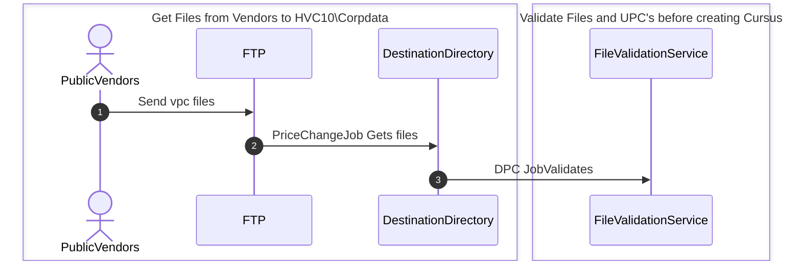
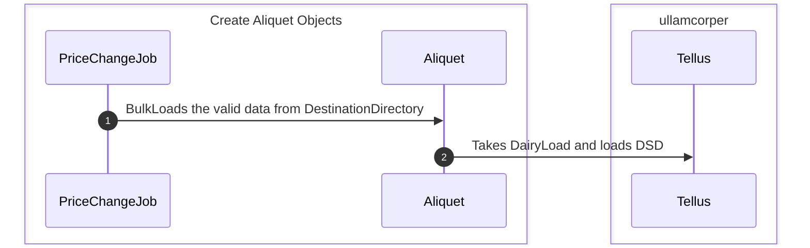

# Price Change Job

## Quick Description

### Lorem ipsum dolor sit amet, consectetur adipiscing elit, sed do eiusmod tempor incididunt ut labore et dolore magna aliqua. Faucibus interdum posuere lorem ipsum dolor sit amet. Urna et pharetra pharetra massa massa. Tortor at risus viverra adipiscing at in tellus integer. In mollis nunc sed id semper.

---

## Job Details

### `Job Schedule`

- CRON EXPRESSION 35 6-23/1 \* \* \*
- 35 minutes past the hour, every 1 hours, between 06:00 AM and 11:59 PM
- 6:35 AM - 11: 35 pm once per hour.

### `Tables\FTPServer`

- UNKOWNSERVER/Shared
  - enim || faucibus  || turpis  || faucibus  || enim  || faucibus 

### `Stored Procedures`

- UNKOWNSERVER
  - pharetra 

#

## Laymans Terms

1. Checks to see if it is already running
2. Grabs vendor files (vpc\*.csv) from ftp server and stores them on [DestinationDirectory]
3. For each file Validate file then remove Bad upc
   1. `File Validation`
      1. Vendor in the file must exist on Vendor table
      2. Effective date must be beyond the day the job is running
   2. `Bad UPC's`
      1. UPC length must be less than 14
      2. No upc can be less than "0000000002510"
         1. 3510 will be padded out to "0000000003510" in the case it would be ok.
      3. Email `UnkownEmail3@Fringilla.com` with bad upcs with Subject Invalid UPCS
   3. If file Validation fails move file to [BadFilesDirectory] and continue to next file
   4. BulkLoad records into [dolor ] on UNKOWNSERVER
4. After each file is loaded, run ipsum  stored procedure

   1. `ipsum `

      1. Attempts to merge data with the following conditions:

         |    [ipsum ]    |     [dolor ] |
         | :------------: | :--------------: |
         |    pc_marid    |    vpc_dlgid     |
         |    pc_venid    |    vpc_venid     |
         |   pc_whscode   |   vpc_whscode    |
         |  pc_eff_date   |   vpc_eff_date   |

      2. When these match ipsum  updates description , size, cost, casepack from dolor 
      3. When they do not match, create new records for [ipsum ] with data from [dolor ]
      4. When finished remove all data from [dolor ]

5. Log Vendor File Metrics
   1. Log to [VendorFileMetrics] with type and total item count.
6. Backup file to [BackupDirectory] and delete it from [DestinationDirectory]
7. Send Email to Admin@Fringilla.com if Vendor Price Changes are late

   1. The The window for checking is between 5 days before and 5 days after the first of the month and the time must be before 8:25 am

      1. Uses this code to find the pch_eff_date for each Vendor
         ```
         SELECT ven_number, ven_name, MAX(pch_eff_date) AS 'pch_eff_date'
             FROM dbo.condimentum 
             INNER JOIN dbo.Porttitor ON pch_venid = ven_venid
             WHERE ven_number IN ('00000000','00000000','00000000','00000000')
             GROUP BY ven_number, ven_name
             ORDER BY ven_number, ven_name";
         ```
      2. Results look something like this:

         | ven_number |     ven_name      |    pch_eff_date     |
         | :--------: | :---------------: | :-----------------: |
         |  00000000  |    Ullamcorper    | 2023-03-02 00:00:00 |
         |  00000000  |      Dapibus      | 2023-03-01 00:00:00 |
         |  00000000  |     Vulputate     | 2023-04-01 00:00:00 |
         |  00000000  |       Risus       | 2023-03-02 00:00:00 |

      3. If any of the pch_eff_date is less than the first of the month email UnkownEmail@Fringilla.com which vendors have not submitted their price changes or the price failed to load successfully.

#

## Sequence Diagram





[DestinationDirectory]: ## "UnkownFolder"
[BadFilesDirectory]: ## "UnkownFolder\\BadFiles\"
[BackupDirectory]: ## "\\UnkownFolder\OldFiles\"
[dolor ]: ## "blandit "
[ipsum ]: ## "molestie "
[VendorFileMetrics]: ## "adipiscing "